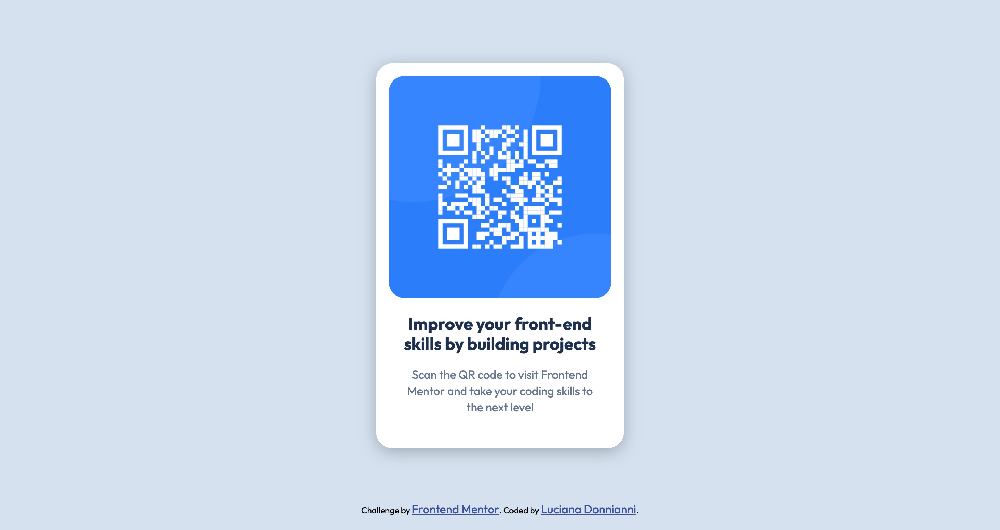

# Frontend Mentor - QR code component solution

This is a solution to the [QR code component challenge on Frontend Mentor](https://www.frontendmentor.io/challenges/qr-code-component-iux_sIO_H). Frontend Mentor challenges help you improve your coding skills by building realistic projects. 

## Table of contents

- [Overview](#overview)
  - [Screenshot](#screenshot)
  - [Links](#links)
- [My process](#my-process)
  - [Built with](#built-with)
  - [What I learned](#what-i-learned)
  - [Continued development](#continued-development)
- [Author](#author)

## Overview

### Screenshot

### Links

- Solution URL: [https://github.com/ldonnianni/qr-code-component-main](https://your-solution-url.com)
- Live Site URL: [https://ldonnianni.github.io/qr-code-component-main/](https://your-live-site-url.com)

## My process

### Built with

- Semantic HTML5 markup
- CSS custom properties
- Flexbox

### What I learned

I started doing the learning path from the begining, to refresh concepts. This is the second time I do this challenge. and this time is much better.

### Continued development

I would like to keep practicing the basics skills and finished the learning patsh.

## Author

- Frontend Mentor - [@ldonnianni](https://www.frontendmentor.io/profile/ldonnianni)

